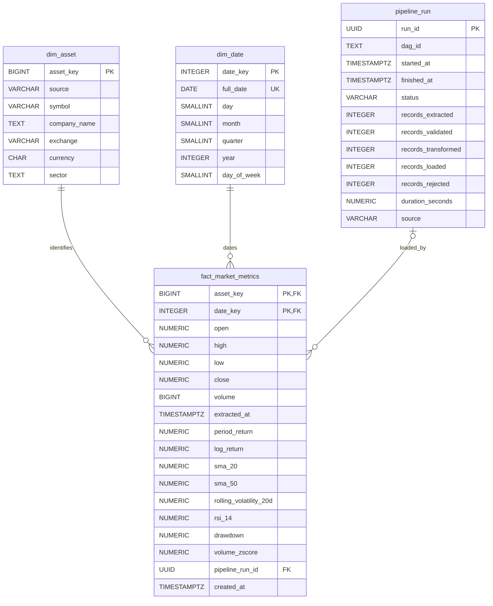

# PostgreSQL Gold Warehouse Schema

**Status:** Proposed

**Related issue:** #17

**Milestone:** M4 — Warehouse

## 1. Purpose

This document defines the proposed PostgreSQL Gold-layer warehouse schema for the financial market data platform.

It refines the preliminary dimensional model in `docs/architecture/initial-architecture.md` and establishes the design contract for subsequent database implementation.

The Gold layer will store validated daily market observations and, after M5, calculated financial metrics. PostgreSQL will serve as the analytical storage layer consumed by the read-only Streamlit dashboard.

## 2. Scope

The initial design covers four logical tables:

- `dim_asset` — financial instrument dimension
- `dim_date` — calendar dimension
- `fact_market_metrics` — daily market observations and derived metrics
- `pipeline_run` — pipeline execution metadata

This document specifies the logical model, intended keys, relationships, data types, constraints, and loading behavior.

Database deployment, migrations, ETL loading, and financial metric calculations are outside the scope of Issue #17.

## 3. Analytical Grain

The primary analytical grain is:

**One fact row per financial asset per trading date.**

For the initial implementation, a financial asset is identified by the combination of its data provider (`source`) and ticker (`symbol`).

The fact table must enforce:

`UNIQUE(asset_key, date_key)`

This prevents duplicate observations when the same Silver data is loaded repeatedly.

The initial project covers five US equities from Twelve Data. Exchange-specific instrument identifiers may be required when supporting additional markets or providers.

## 4. Logical Data Model

### Business Keys and Composite Constraints

Mermaid ERD notation does not fully express the composite constraints used in this design.

The authoritative database constraints are:

| Table | Constraint | Columns |
|---|---|---|
| `dim_asset` | Primary key | `asset_key` |
| `dim_asset` | Composite unique constraint | `(source, symbol)` |
| `dim_date` | Primary key | `date_key` |
| `dim_date` | Unique constraint | `full_date` |
| `fact_market_metrics` | Composite primary key | `(asset_key, date_key)` |
| `pipeline_run` | Primary key | `run_id` |

The fact table also contains foreign keys to both dimensions and an optional foreign key to `pipeline_run`.

These constraints enforce the intended analytical grain and provide the conflict keys for idempotent loading.

The detailed columns and constraints will be defined in the following sections.

## 5. Asset Dimension: `dim_asset`

### 5.1 Purpose and Grain

`dim_asset` stores one row per distinct financial instrument identity known to the platform.

For the initial dataset, an instrument is identified by:

`(source, symbol)`

Examples include `(twelve_data, AAPL)` and `(twelve_data, MSFT)`.

This identity model is sufficient for the current five US equities but does not universally distinguish securities with identical tickers on different exchanges.

### 5.2 Proposed Columns

| Column | PostgreSQL Type | Constraints | Description |
|---|---|---|---|
| `asset_key` | `BIGINT` | Primary key, generated identity | Warehouse surrogate identifier |
| `source` | `VARCHAR(50)` | NOT NULL | Data provider identifier |
| `symbol` | `VARCHAR(20)` | NOT NULL | Instrument ticker |
| `company_name` | `TEXT` | Nullable | Company name, if known |
| `exchange` | `VARCHAR(50)` | Nullable | Exchange identifier, if known |
| `currency` | `CHAR(3)` | Nullable | ISO 4217 currency code, if known |
| `sector` | `TEXT` | Nullable | Industry sector, if known |

### 5.3 Keys and Constraints

- Primary key: `asset_key`.
- Business uniqueness: `UNIQUE(source, symbol)`.
- `source` and `symbol` must be nonempty after trimming whitespace.
- Do not generate placeholder values for missing descriptive attributes.
- Normalize provider identifiers and ticker symbols consistently before loading.

### 5.4 Loading and Idempotency

During Silver-to-Gold loading:

1. Read the `source` and `symbol` from each validated Silver record.
2. Look up the corresponding asset using `(source, symbol)`.
3. Insert the asset if it does not exist.
4. Reuse its existing `asset_key` for subsequent observations.

Repeated loads must not create duplicate dimension rows.

### 5.5 Assumptions and Limitations

The initial platform supports five US equities from Twelve Data.

`(source, symbol)` is therefore the initial business identity, not a universally reliable financial instrument identifier.

Future support for multiple exchanges, asset classes, ticker changes, or provider reconciliation may require a richer instrument identifier and a migration strategy.

Descriptive attributes such as company name, exchange, currency, and sector are optional because they are not present in the current canonical market data model.

## 6. Date Dimension: `dim_date`

### 6.1 Purpose and Grain

`dim_date` stores one row per calendar date.

The date dimension supports analytical grouping and filtering by year, quarter, month, and day of the week.

Calendar dates are not assumed to be trading dates. Only dates with market observations will be referenced by market fact rows.

### 6.2 Proposed Columns

| Column | PostgreSQL Type | Constraints | Description |
|---|---|---|---|
| `date_key` | `INTEGER` | Primary key | Date identifier in YYYYMMDD format |
| `full_date` | `DATE` | NOT NULL, UNIQUE | Actual calendar date |
| `day` | `SMALLINT` | NOT NULL | Day of month, 1–31 |
| `month` | `SMALLINT` | NOT NULL | Month number, 1–12 |
| `quarter` | `SMALLINT` | NOT NULL | Calendar quarter, 1–4 |
| `year` | `INTEGER` | NOT NULL | Calendar year |
| `day_of_week` | `SMALLINT` | NOT NULL | ISO weekday: Monday=1 through Sunday=7 |

### 6.3 Keys and Constraints

- Primary key: `date_key`.
- Business uniqueness: `UNIQUE(full_date)`.
- `date_key` must equal the integer representation of `full_date` in YYYYMMDD format.
- `day`, `month`, `quarter`, `year`, and `day_of_week` must be consistent with `full_date`.
- Calendar attributes must be derived programmatically rather than entered manually.

### 6.4 Loading and Idempotency

The date dimension will be populated deterministically from calendar dates.

For each observation date:

1. Convert the date to its YYYYMMDD integer key.
2. Derive the required calendar attributes.
3. Insert the date row if it does not exist.
4. Reuse the existing date row during repeated loads.

Generating a predefined date range is also acceptable, provided repeated execution does not create duplicates.

### 6.5 Calendar and Trading-Day Limitations

The initial implementation will not include an `is_trading_day` indicator.

A weekday is not necessarily a trading session because exchanges observe holidays and may have exceptional closures.

The presence of a market fact row indicates that an observation exists for that asset and date; it does not prove that every other date without a row was a market holiday.

Moving averages and other rolling metrics in M5 must be calculated over correctly ordered market observations, not blindly over consecutive calendar days.

## 7. Market Metrics Fact Table: `fact_market_metrics`

### 7.1 Purpose and Grain

`fact_market_metrics` stores one row per asset per market observation date.

The fact table contains validated daily OHLCV observations and, when available, calculated financial metrics.

**Fact grain:** One row for each `(asset_key, date_key)` pair.

Asset identity is defined by `(source, symbol)` in `dim_asset`.

### 7.2 Proposed Columns

| Column | PostgreSQL Type | Constraints | Description |
|---|---|---|---|
| `asset_key` | `BIGINT` | NOT NULL, FK to `dim_asset` | Financial asset identifier |
| `date_key` | `INTEGER` | NOT NULL, FK to `dim_date` | Observation date identifier |
| `open` | `NUMERIC(20,8)` | NOT NULL | Opening price |
| `high` | `NUMERIC(20,8)` | NOT NULL | Highest price |
| `low` | `NUMERIC(20,8)` | NOT NULL | Lowest price |
| `close` | `NUMERIC(20,8)` | NOT NULL | Closing price |
| `volume` | `BIGINT` | NOT NULL | Trading volume |
| `extracted_at` | `TIMESTAMPTZ` | NOT NULL | UTC-aware extraction timestamp |
| `period_return` | `NUMERIC(20,8)` | Nullable | Return relative to previous trading observation |
| `log_return` | `NUMERIC(20,8)` | Nullable | Natural logarithm of price ratio |
| `sma_20` | `NUMERIC(20,8)` | Nullable | 20-observation simple moving average |
| `sma_50` | `NUMERIC(20,8)` | Nullable | 50-observation simple moving average |
| `rolling_volatility_20d` | `NUMERIC(20,8)` | Nullable | Rolling return volatility |
| `rsi_14` | `NUMERIC(20,8)` | Nullable | 14-period relative strength index |
| `drawdown` | `NUMERIC(20,8)` | Nullable | Decline relative to a previous peak |
| `volume_zscore` | `NUMERIC(20,8)` | Nullable | Standardized volume relative to a rolling window |
| `pipeline_run_id` | `UUID` | Nullable, FK to `pipeline_run` | Execution responsible for the latest load |
| `created_at` | `TIMESTAMPTZ` | NOT NULL, default current timestamp | First warehouse insertion time |

### 7.3 Keys and Relationships

- Composite primary key: `(asset_key, date_key)`.
- `asset_key` references `dim_asset(asset_key)`.
- `date_key` references `dim_date(date_key)`.
- `pipeline_run_id` optionally references `pipeline_run(run_id)`.
- No separate fact surrogate key is required for the initial project.

The composite primary key enforces the same logical uniqueness requirement described in the initial architecture.

### 7.4 Data Quality Constraints

Valid fact records must satisfy:

- `open`, `high`, `low`, and `close` are strictly positive.
- `volume` is nonnegative.
- `high >= low`.
- `open` and `close` fall within the inclusive `[low, high]` range.
- `extracted_at` is present.
- Required foreign keys reference existing dimension rows.

These rules mirror the upstream Silver-layer validation.

PostgreSQL constraints provide an additional defensive boundary rather than replacing upstream validation.

### 7.5 Derived Financial Metrics

The calculated metric columns will remain nullable until the M5 transformation layer produces their values.

A null value may represent an unavailable or not-yet-computed metric. The implementation must distinguish these situations when operationally necessary.

For example:

- The first daily return has no previous observation.
- A 20-observation moving average requires sufficient historical records.
- Some rolling calculations may be unavailable near the start of a dataset.

M5 will define precise formulas, rolling-window conventions, minimum observation requirements, and rounding behavior.

The warehouse design does not imply that all proposed metrics have already been implemented.

### 7.6 Loading and Idempotency

Silver-to-Gold loading must:

1. Read validated canonical observations from Silver Parquet.
2. Resolve each observation's `asset_key` using `(source, symbol)`.
3. Resolve `date_key` from `observation_date`.
4. Insert or update the corresponding fact row using `(asset_key, date_key)` as the conflict key.
5. Preserve financial decimal precision and extraction provenance.

A PostgreSQL upsert using `ON CONFLICT (asset_key, date_key)` is the proposed loading strategy.

Repeated loading of identical source observations must not increase the number of fact rows.

When corrected observations arrive for an existing key, the loader should update the appropriate market values rather than insert duplicates.

The precise update policy for derived metrics will be finalized alongside the M5 transformation workflow so that stale calculated metrics are not retained after an OHLCV correction.

### 7.7 Limitations and Future Extensions

- The initial fact grain supports one observation per provider-specific asset per date.
- Multiple observations for the same asset and date are consolidated by the configured upsert policy.
- Full historical versioning of corrected observations is outside the initial scope.
- The schema does not yet represent intraday intervals or multiple exchanges sharing an ambiguous ticker identity.
- The fact table is designed for analytics, not as a substitute for immutable Raw source history.
- Cross-table loading transactions and concurrency control will be addressed during warehouse implementation.

## 8. Pipeline Execution Metadata: `pipeline_run`

### 8.1 Purpose and Grain

`pipeline_run` stores operational metadata about pipeline executions.

**Grain:** One row per logical pipeline execution.

This table supports auditability, troubleshooting, monitoring, and reporting on pipeline activity.

It is not part of the financial analytical grain.

### 8.2 Proposed Columns

| Column | PostgreSQL Type | Constraints | Description |
|---|---|---|---|
| `run_id` | `UUID` | Primary key | Unique pipeline execution identifier |
| `dag_id` | `TEXT` | Nullable | Airflow DAG identifier, when applicable |
| `started_at` | `TIMESTAMPTZ` | NOT NULL | Execution start timestamp |
| `finished_at` | `TIMESTAMPTZ` | Nullable | Execution completion timestamp |
| `status` | `VARCHAR(20)` | NOT NULL | Current execution status |
| `records_extracted` | `INTEGER` | NOT NULL, default 0 | Records retrieved from the source |
| `records_validated` | `INTEGER` | NOT NULL, default 0 | Records accepted by data-quality validation |
| `records_transformed` | `INTEGER` | NOT NULL, default 0 | Records processed by business transformations |
| `records_loaded` | `INTEGER` | NOT NULL, default 0 | Records written or updated in Gold |
| `records_rejected` | `INTEGER` | NOT NULL, default 0 | Records rejected by validation |
| `duration_seconds` | `NUMERIC(12,3)` | Nullable | Execution duration in seconds |
| `source` | `VARCHAR(50)` | Nullable | Source provider associated with the run |

### 8.3 Keys and Constraints

- Primary key: `run_id`.
- `status` must be one of: `running`, `success`, or `failed`.
- All record counters must be nonnegative.
- `finished_at` must not precede `started_at`.
- `duration_seconds`, when provided, must be nonnegative.
- `dag_id` is optional because executions may be initiated outside Airflow.
- `finished_at` and `duration_seconds` can remain null while an execution is running.

### 8.4 Relationship to Market Facts

`fact_market_metrics.pipeline_run_id` optionally references `pipeline_run.run_id`.

The relationship indicates the execution associated with the latest successful load or update of a market fact.

A pipeline run may load many fact rows.

A fact row may temporarily have no associated run until operational metadata tracking is implemented.

The relationship is optional to allow incremental development without generating artificial execution records.

This foreign key is not a complete history of every execution that has processed a fact. Detailed load history would require an additional audit structure.

### 8.5 Execution Lifecycle

The proposed lifecycle is:

1. Generate a unique `run_id`.
2. Insert a `pipeline_run` row with `status = 'running'` and `started_at`.
3. Execute ingestion, validation, transformation, and loading.
4. Update record counters as verified processing results become available.
5. Set `finished_at`, `duration_seconds`, and a terminal status of `success` or `failed`.

The implementation must preserve meaningful failure information rather than incorrectly marking an unsuccessful execution as successful.

### 8.6 Counter Semantics

The counters represent activity during one execution, not cumulative warehouse totals.

- `records_extracted`: source observations retrieved during the run.
- `records_validated`: observations accepted by data-quality validation.
- `records_transformed`: observations successfully processed by business transformations.
- `records_loaded`: fact rows successfully inserted or updated in Gold.
- `records_rejected`: observations rejected by data-quality validation.

Actual counter collection and persistence will be implemented in the later ingestion, orchestration, and observability work.

A replay that does not request the API again may have zero newly extracted records even though it processes previously preserved Raw observations.

### 8.7 Implementation Boundary

Issue #17 defines the metadata schema only.

It does not implement:

- Airflow DAGs or execution scheduling
- UUID generation in the pipeline
- Database inserts or updates for run metadata
- Metrics collection or monitoring dashboards
- Historical execution auditing beyond the proposed table

Those responsibilities belong to subsequent implementation milestones.

## 9. Silver-to-Gold Loading Strategy

### 9.1 Source and Destination

The Silver layer contains validated daily market observations stored as Parquet files.

Each canonical record provides:

- `source`
- `symbol`
- `observation_date`
- `open`, `high`, `low`, `close`
- `volume`
- `extracted_at`

The Gold layer stores these observations in PostgreSQL using the dimensional model defined above.

Silver remains the validated historical input. Gold is the query-optimized analytical representation.

### 9.2 Proposed Loading Sequence

For each eligible Silver batch:

1. Read validated observations from Silver Parquet.
2. Resolve or insert `dim_asset` rows using `(source, symbol)`.
3. Resolve or insert `dim_date` rows using `observation_date`.
4. Resolve the corresponding `asset_key` and `date_key`.
5. Insert or update `fact_market_metrics` using `(asset_key, date_key)` as the conflict key.
6. Record execution metadata when pipeline-run tracking is available.
7. Report verified loading results and propagate failures.

The implementation should use database transactions to avoid partially committed changes within a logical loading unit.

Transaction boundaries and retry behavior will be specified during loader implementation.

### 9.3 Idempotency and Conflict Handling

The fact table uses the composite primary key:

`PRIMARY KEY (asset_key, date_key)`

PostgreSQL loading will use an upsert strategy based on:

`ON CONFLICT (asset_key, date_key)`

The intended behavior is:

| Situation | Expected Behavior |
|---|---|
| New asset | Insert the corresponding dimension row |
| Existing asset | Reuse its `asset_key` |
| New observation date | Insert or reuse the date dimension row |
| New daily fact | Insert a fact row |
| Repeated identical observation | Keep one fact row without unnecessary changes |
| Corrected OHLCV observation | Update the existing fact row |
| Database failure | Raise an error and avoid reporting a successful load |

Repeated identical loads must not increase the number of fact rows.

### 9.4 Corrected Historical Observations

A provider may revise historical OHLCV values.

When an incoming observation has the same `(asset_key, date_key)` but different OHLCV values:

1. Update the stored observation fields.
2. Update the extraction timestamp to reflect the accepted incoming record.
3. Mark or clear previously computed metrics that may now be stale.
4. Recompute affected financial metrics through the M5 transformation workflow.

Changes to one historical close price can affect metrics on later dates, including daily returns and rolling-window calculations.

Therefore, clearing metrics on only the corrected row is not sufficient to guarantee analytical consistency.

The implementation must define how affected downstream dates are identified and recalculated before claiming the Gold metrics are current.

The initial warehouse design does not implement this recalculation mechanism.

### 9.5 Derived Metrics and Load Ordering

The fact schema reserves nullable columns for future financial metrics.

Until the M5 transformation workflow is implemented, these columns may remain null.

The loader must not silently preserve previously calculated metrics when their underlying OHLCV inputs have changed.

When transformations become available, the preferred logical sequence is:

1. Load or update validated market observations.
2. Calculate or recalculate affected financial metrics.
3. Persist those metrics using the same asset and date keys.
4. Expose analytics-ready results only after the relevant processing steps complete successfully.

The precise sequencing and consistency guarantees will be finalized during M5 implementation and orchestration work.

### 9.6 Provenance

Provider provenance is preserved through `dim_asset.source`.

The original extraction timestamp is represented by `fact_market_metrics.extracted_at`.

When available, `pipeline_run_id` identifies the execution associated with the latest successful load or update.

The Gold layer does not replace preserved Raw JSON or Silver Parquet as the historical data foundation.

### 9.7 Transaction and Retry Considerations

PostgreSQL transactions should group related dimension and fact changes into a well-defined loading unit.

A failed transaction should be rolled back so that its partial database changes are not committed.

Retries must use stable business keys and idempotent upserts.

This design does not provide a transaction spanning filesystem-based Raw, Silver, quarantine, and PostgreSQL storage.

Concurrency, transaction isolation, batching, and detailed failure recovery will be evaluated when implementing the actual loader.

### 9.8 Implementation Boundary

This section defines intended loading behavior only.

Issue #17 does not implement:

- PostgreSQL connections
- SQL upsert statements
- Transaction management
- Parquet readers for warehouse loading
- Historical metric recalculation
- Airflow tasks or database scheduling

## 10. Design Decisions, Trade-offs, and Future Work

### 10.1 Design Decisions

| Decision | Rationale | Trade-off |
|---|---|---|
| PostgreSQL for Gold | Relational constraints, SQL analytics, and reliable upserts | Requires database deployment and administration |
| Dimensional model | Separates asset and calendar attributes from daily observations | Adds dimension lookup steps during loading |
| `(source, symbol)` as asset identity | Matches the information available in Silver | Does not universally identify securities across exchanges |
| `dim_date` with YYYYMMDD keys | Supports calendar grouping and deterministic key generation | Adds a dimension that is not strictly necessary for the initial dataset |
| Composite fact primary key | Directly enforces one observation per asset and date | Must be revisited if intraday or multi-frequency data is added |
| `NUMERIC(20,8)` for prices | Preserves the precision used in Silver Parquet | Decimal arithmetic may be slower than floating-point arithmetic |
| Nullable derived metrics | Allows Gold observations to exist before M5 calculations are available | Null values require clear interpretation in analytical queries |
| Separate `pipeline_run` table | Keeps operational metadata separate from financial data | Requires additional lifecycle and failure-handling logic |
| Idempotent PostgreSQL upserts | Prevents duplicate facts during replay | Corrections require careful handling of affected derived metrics |

### 10.2 Explicit Assumptions

- The initial dataset contains five US equity symbols obtained from Twelve Data.
- Observations have daily granularity.
- Each canonical observation contains a source, symbol, observation date, OHLCV values, and extraction timestamp.
- Silver records have passed upstream data-quality validation.
- Gold loading is intended to be repeatable and idempotent.
- The Streamlit dashboard will query Gold in read-only mode.

### 10.3 Unresolved Implementation Decisions

The following decisions will be finalized during the corresponding implementation work:

- PostgreSQL deployment and configuration.
- Database migration tooling.
- SQL transaction boundaries and batch sizes.
- Concurrent loading and conflict resolution.
- Dimension population and calendar date-range generation.
- Handling of corrections to historical observations and dependent financial metrics.
- Pipeline-run creation, failure tracking, and metadata persistence.
- Data enrichment for company name, exchange, currency, and sector.

### 10.4 Known Limitations

- The initial asset identity may not be sufficient across exchanges or providers that use different ticker conventions.
- The design supports daily observations only.
- Full history of corrected Gold facts is not retained in the proposed schema.
- The fact table's `pipeline_run_id` represents only the associated latest load, not complete processing lineage.
- No distributed transaction exists across Raw files, Silver Parquet, quarantine files, and PostgreSQL.
- The document defines the intended schema; it does not demonstrate that the database has been deployed or tested.

### 10.5 Follow-up Work

The next warehouse implementation tasks will translate this design into PostgreSQL tables, constraints, migrations, and reliable loading operations.

M5 will define and implement financial metric calculations, including exact formulas, rolling-window conventions, and handling of missing history.

Later milestones will introduce Airflow orchestration, integration testing, observability, and analytical dashboards.
