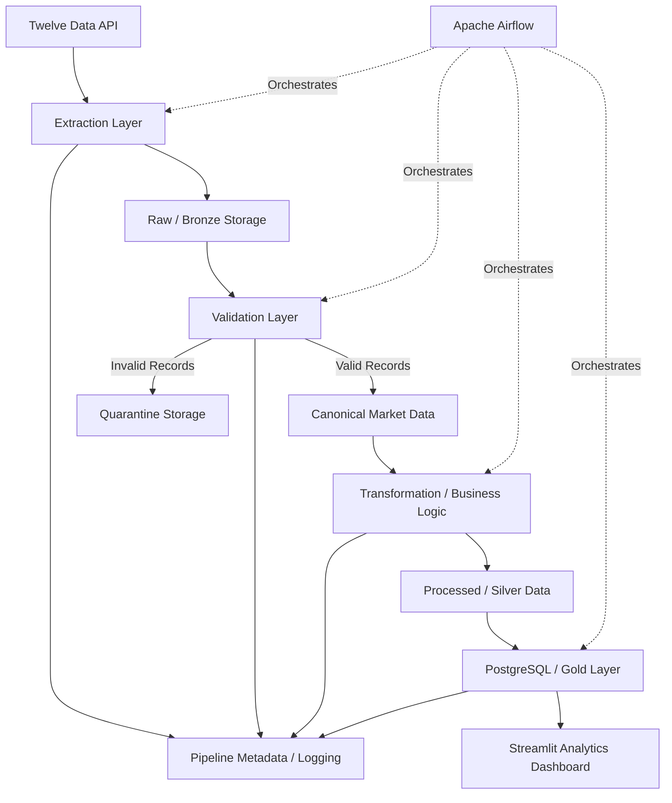
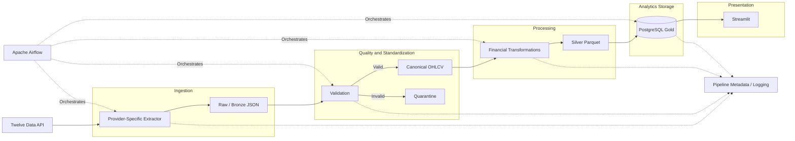

# Initial Data Pipeline Architecture

## 1. Purpose

This document defines the initial end-to-end architecture of the financial market data platform.

The architecture translates the project requirements and the financial data-source decision into clearly separated pipeline components. The design focuses on reproducibility, idempotency, testability, observability, recoverability, and separation of responsibilities.

Twelve Data is used as the primary financial market data provider according to `ADR-001 — Financial Data Source`. Provider-specific behavior is isolated within the extraction layer so that downstream components do not depend directly on the Twelve Data response format.

The platform is designed primarily as a scheduled financial analytics pipeline rather than a high-frequency or real-time trading system.

---

## 2. Architecture Goals

The architecture should:

- preserve source data before transformation;
- separate extraction, validation, transformation, loading, orchestration, and presentation responsibilities;
- isolate provider-specific API logic;
- provide a canonical internal market-data representation;
- support historical backfills and incremental ingestion;
- support safe and idempotent reruns;
- quarantine invalid records rather than silently discarding them;
- calculate financial metrics within the transformation layer;
- load analytical results into a dimensional PostgreSQL model;
- keep orchestration logic separate from business logic;
- expose pipeline execution metadata for observability;
- support automated testing at multiple layers;
- remain reproducible through Docker and Docker Compose;
- operate within the project's zero-cost constraint; and
- allow individual components to evolve without requiring a complete redesign.

---

## 3. High-Level Architecture

The platform follows a layered data-processing architecture.



The architecture separates the system into the following major layers:

1. **Source Layer** — provides external financial market observations.
2. **Extraction Layer** — communicates with the external provider and preserves the response.
3. **Raw / Bronze Layer** — stores immutable source responses before business transformations.
4. **Validation Layer** — validates response structure and market-data quality.
5. **Canonical Data Layer** — converts provider-specific data into a stable internal representation.
6. **Quarantine Layer** — stores rejected records together with rejection information.
7. **Transformation / Business Logic Layer** — calculates financial metrics from validated canonical observations.
8. **Processed / Silver Layer** — stores validated and transformed analytical datasets.
9. **PostgreSQL / Gold Layer** — stores analytics-ready dimensional data.
10. **Presentation Layer** — provides read-only analytical visualization through Streamlit.
11. **Orchestration Layer** — coordinates pipeline execution using Apache Airflow.
12. **Observability Layer** — records execution metadata, counts, durations, and failures.

---

## 4. End-to-End Data Flow

A normal pipeline execution follows the sequence below.

### 4.1 Extraction

Airflow initiates an extraction task for the configured financial assets.

The extraction component communicates with Twelve Data and retrieves the required daily OHLCV observations.

Provider-specific concerns are handled inside this component, including:

- authentication;
- request construction;
- API timeouts;
- HTTP failures;
- provider-specific error responses;
- rate-limit responses;
- malformed responses; and
- bounded retry behavior.

The extraction component does not calculate financial indicators.

### 4.2 Raw Preservation

A successful API response is persisted before downstream transformation.

The raw layer preserves the provider response as evidence of what was received from the external system at a particular extraction time.

Raw data is not treated as analytics-ready data.

This separation allows the project to:

- reproduce transformations without repeating an API request;
- investigate upstream data problems;
- test transformations against known inputs;
- preserve experimental evidence; and
- reduce unnecessary API usage.

### 4.3 Validation

Raw observations are validated before entering the analytical transformation flow.

Validation includes both structural and business-oriented data-quality checks.

Examples include:

- required fields are present;
- symbol is present;
- observation date is valid;
- OHLC prices are positive;
- volume is non-negative;
- `high >= low`;
- `high >= open`;
- `high >= close`;
- `low <= open`;
- `low <= close`; and
- duplicate observations are detected.

Records that pass validation continue through the pipeline.

Records that fail validation are written to quarantine together with information describing why they were rejected.

### 4.4 Canonical Normalization

Validated provider records are converted into a provider-independent internal representation.

A canonical observation contains fields conceptually equivalent to:

| Field | Purpose |
|---|---|
| `symbol` | Financial instrument identifier |
| `observation_date` | Trading date represented by the observation |
| `open` | Opening price |
| `high` | Highest price |
| `low` | Lowest price |
| `close` | Closing price |
| `volume` | Trading volume |
| `source` | Data provider identifier |
| `extracted_at` | Timestamp when the source data was extracted |

Downstream components operate on this representation rather than directly on Twelve Data's native JSON structure.

This creates a boundary between provider-specific ingestion and provider-independent business logic.

### 4.5 Transformation and Business Logic

Validated canonical observations are processed by the transformation layer.

The transformation layer is responsible for financial calculations such as:

- period return;
- logarithmic return;
- simple moving averages;
- rolling volatility;
- drawdown;
- RSI; and
- rolling volume statistics.

Financial calculations are implemented in reusable Python modules rather than inside Airflow DAG definitions or Streamlit components.

This allows the same transformation logic to be unit tested independently of orchestration and presentation.

### 4.6 Processed / Silver Storage

Validated and transformed datasets are persisted in a processed layer before final analytical loading.

This layer provides an intermediate representation that can be inspected independently from both the raw API response and the final dimensional database.

It can also support transformation experiments, including comparisons between Pandas and PySpark.

### 4.7 PostgreSQL / Gold Loading

Analytics-ready data is loaded into PostgreSQL.

The database represents the Gold analytical layer and uses a dimensional model suitable for analytical queries.

The initial model is expected to include:

- an asset dimension;
- a date dimension;
- a market-metrics fact table; and
- pipeline execution metadata.

Database loading must be idempotent. Reprocessing the same asset and observation date must not create duplicate analytical facts.

### 4.8 Presentation

Streamlit reads analytics-ready information from PostgreSQL.

The dashboard is treated as a presentation layer rather than a transformation engine.

Financial indicators should therefore be calculated upstream wherever practical.

The dashboard should use read-only database access and should not modify pipeline data.

### 4.9 Orchestration

Apache Airflow coordinates execution of the pipeline components.

Airflow is responsible for concerns such as:

- task ordering;
- scheduling;
- retries;
- dependency management;
- execution status; and
- operational visibility.

Airflow DAG definitions should remain thin.

Provider communication, validation rules, financial calculations, and database business logic should remain in reusable application modules rather than being implemented directly inside DAG files.

---

## 5. Separation of Responsibilities

A central architectural principle is that each component should have a clearly defined responsibility.

| Component | Responsible For | Not Responsible For |
|---|---|---|
| Twelve Data extractor | API communication and provider-specific handling | Financial calculations |
| Raw storage | Preserving source responses | Business transformations |
| Validation | Structural and data-quality checks | Dashboard rendering |
| Canonical normalization | Provider-independent schema conversion | Financial analytics |
| Transformation layer | Financial business logic | Scheduling |
| Silver storage | Persisting transformed datasets | API communication |
| PostgreSQL | Analytics-ready dimensional storage | External API extraction |
| Airflow | Scheduling and orchestration | Implementing financial formulas |
| Streamlit | Read-only presentation and exploration | Core ETL transformations |
| Metadata layer | Pipeline execution information | Financial market calculations |

This separation reduces coupling and allows components to be tested and replaced independently.

---

## 6. Storage Architecture and Data Lifecycle

The platform uses separate storage layers so that source data, validated analytical data, rejected records, and final dimensional data have distinct responsibilities.

The initial storage lifecycle is:

```text
Twelve Data API
       |
       v
Raw / Bronze
       |
       v
Validation
   |         |
   |         +------> Quarantine
   |
   v
Canonical Valid Data
       |
       v
Transformation
       |
       v
Processed / Silver
       |
       v
PostgreSQL / Gold
```

The initial implementation uses the local filesystem for Raw, Silver, and Quarantine storage and PostgreSQL for the Gold analytical layer.

This approach keeps the project reproducible and compatible with the zero-cost constraint while maintaining clear data-engineering boundaries.

---

### 6.1 Raw / Bronze Layer

The Raw / Bronze layer stores source data as received from the external provider before financial transformations are applied.

Its primary purposes are:

- preserving source evidence;
- enabling reprocessing without another API request;
- supporting debugging;
- reducing unnecessary API consumption;
- supporting reproducible tests and experiments; and
- separating ingestion from transformation.

Raw data should remain as close as practical to the original provider response.

For Twelve Data, the initial raw representation will use JSON because the source API naturally returns structured JSON containing both metadata and time-series values.

A conceptual directory structure is:

```text
data/
└── raw/
    └── twelve-data/
        └── <extraction-date>/
            ├── AAPL.json
            ├── MSFT.json
            ├── NVDA.json
            ├── AMZN.json
            └── GOOGL.json
```

The exact production naming convention may later include additional information such as:

- extraction timestamp;
- pipeline run identifier;
- requested date range; or
- ingestion mode.

Raw files should not be manually edited after ingestion.

If the same source data must be processed again, downstream stages should read the preserved raw data rather than modifying the original source evidence.

Raw API responses must not be committed to the public Git repository.

---

### 6.2 Canonical Data Representation

Provider-specific raw responses are converted into a canonical internal schema after structural validation.

The purpose of the canonical representation is to prevent downstream components from depending on Twelve Data-specific field organization.

The initial canonical market-data schema is:

| Field | Type | Description |
|---|---|---|
| `symbol` | string | Financial instrument identifier |
| `observation_date` | date | Trading date represented by the observation |
| `open` | decimal/numeric | Opening price |
| `high` | decimal/numeric | Highest price |
| `low` | decimal/numeric | Lowest price |
| `close` | decimal/numeric | Closing price |
| `volume` | integer | Trading volume |
| `source` | string | Source provider identifier |
| `extracted_at` | timestamp | Timestamp when the source response was extracted |

The canonical representation is provider-independent.

For example, Twelve Data currently supplies the observation timestamp using the field `datetime`. The normalization layer converts this provider-specific field into the project's internal `observation_date` field.

If another provider is introduced later, its extractor and normalization logic must produce the same canonical representation.

---

### 6.3 Processed / Silver Layer

The Processed / Silver layer contains validated and transformed datasets.

Unlike the Raw layer, Silver data follows the project's internal schema and may contain calculated financial metrics.

The Silver layer may contain fields such as:

- symbol;
- observation date;
- OHLCV values;
- period return;
- logarithmic return;
- SMA 20;
- SMA 50;
- rolling volatility;
- RSI 14;
- drawdown;
- rolling volume statistics;
- source; and
- processing metadata.

Parquet is the preferred initial storage format for Silver data.

Parquet is appropriate because the processed layer is tabular, typed, and intended for analytical processing. It also provides an appropriate format for later Pandas and PySpark experiments.

A conceptual structure is:

```text
data/
└── processed/
    └── market-data/
        └── <processing-date>/
            └── market_metrics.parquet
```

The exact partitioning strategy may be refined during implementation after the expected data volume and access patterns are measured.

The architecture should avoid unnecessary small-file complexity for the relatively small educational dataset.

---

### 6.4 Quarantine Layer

Records that fail data-quality validation should not silently disappear and should not enter the analytical dataset.

Instead, rejected records are written to a quarantine area.

A quarantined record should preserve enough information to determine:

- what record failed;
- which validation rule failed;
- when the failure was detected;
- which pipeline run detected the failure; and
- which source produced the record.

A conceptual quarantine record contains:

| Field | Description |
|---|---|
| `record` | Original or normalized rejected record |
| `reason` | Human-readable rejection reason |
| `rule` | Identifier of the failed validation rule |
| `source` | Source provider |
| `run_id` | Pipeline execution identifier |
| `detected_at` | Timestamp when rejection occurred |

A conceptual filesystem structure is:

```text
data/
└── quarantine/
    └── <processing-date>/
        └── rejected_records.json
```

Quarantine data is operational evidence rather than analytics-ready data.

The existence of quarantined records should also be reflected in pipeline metadata so that a pipeline execution can report both accepted and rejected record counts.

---

### 6.5 PostgreSQL / Gold Layer

PostgreSQL represents the persistent analytics-ready Gold layer.

The Gold layer stores validated and transformed data using a dimensional model.

The initial logical model contains:

```text
dim_asset
dim_date
fact_market_metrics
pipeline_run
```

The expected responsibilities are:

#### `dim_asset`

Stores descriptive information about financial instruments.

Potential attributes include:

- `asset_key`
- `symbol`
- `company_name`
- `exchange`
- `currency`
- `sector`

#### `dim_date`

Stores reusable calendar attributes.

Potential attributes include:

- `date_key`
- `full_date`
- `day`
- `month`
- `quarter`
- `year`
- `day_of_week`

#### `fact_market_metrics`

Stores daily market observations and calculated financial metrics.

Potential attributes include:

- `asset_key`
- `date_key`
- `open`
- `high`
- `low`
- `close`
- `volume`
- `period_return`
- `log_return`
- `sma_20`
- `sma_50`
- `rolling_volatility_20d`
- `rsi_14`
- `drawdown`
- `volume_zscore`
- `pipeline_run_id`
- `created_at`

The final schema will be defined separately before database implementation.

#### `pipeline_run`

Stores operational information about pipeline executions.

Potential attributes include:

- `run_id`
- `dag_id`
- `started_at`
- `finished_at`
- `status`
- `records_extracted`
- `records_validated`
- `records_transformed`
- `records_loaded`
- `records_rejected`
- `duration_seconds`
- `source`

This metadata allows pipeline health and execution history to be analyzed independently from financial market facts.

---

## 7. Historical Backfill and Incremental Ingestion

The pipeline must support two ingestion modes:

1. historical backfill;
2. incremental ingestion.

Both modes should use the same downstream validation, normalization, transformation, and loading logic.

---

### 7.1 Historical Backfill

Historical backfill initializes or reconstructs the analytical dataset using a defined historical period.

A typical backfill flow is:

```text
Requested historical range
        |
        v
Twelve Data extraction
        |
        v
Raw preservation
        |
        v
Validation
        |
        v
Canonical normalization
        |
        v
Financial transformations
        |
        v
Silver storage
        |
        v
PostgreSQL upsert
```

The historical range should be explicitly configurable rather than permanently embedded in source code.

Backfills may be executed when:

- initializing the platform;
- adding a new asset;
- rebuilding derived metrics;
- recovering from data loss;
- correcting transformation logic; or
- running controlled experiments.

Backfill execution must remain idempotent.

Running the same historical range more than once must not create duplicate Gold records.

---

### 7.2 Incremental Ingestion

Normal scheduled executions should avoid repeatedly retrieving the entire historical dataset.

Instead, the pipeline should determine the required incremental period and request only the observations needed to bring the platform up to date.

Conceptually:

```text
Latest successfully stored observation
                |
                v
Determine required start date
                |
                v
Request missing observations
                |
                v
Normal pipeline processing
```

For example, if PostgreSQL already contains validated data through September 24 and the provider contains a new September 25 observation, the scheduled pipeline should retrieve and process the missing period rather than downloading the entire historical dataset again.

The implementation may intentionally request a small overlap window to safely handle corrections or late-arriving observations.

Because downstream loading is idempotent, overlapping observations can be reprocessed without creating duplicates.

The exact overlap policy will be determined during implementation and tested experimentally.

---

### 7.3 Shared Processing Path

Historical and incremental ingestion should not become two completely separate pipelines.

Both modes should converge on the same core processing path:

```text
Extraction
    |
    v
Raw Preservation
    |
    v
Validation
    |
    v
Canonical Normalization
    |
    v
Transformation
    |
    v
Silver
    |
    v
Gold
```

Only the extraction range and execution context should differ.

This reduces duplicated code and ensures that historical and scheduled data are processed using the same validation and business rules.

---

## 8. Idempotency Strategy

Idempotency is a core non-functional requirement of the platform.

A pipeline execution is considered idempotent when rerunning the same logical input does not create duplicate analytical results or corrupt existing data.

Idempotency must be considered at multiple layers rather than being implemented only at the final database load.

---

### 8.1 Raw Layer Idempotency

Raw data represents source evidence and should not be destructively overwritten without a deliberate policy.

Each extraction should be identifiable using metadata such as:

- source;
- symbol;
- requested date range;
- extraction timestamp; and
- pipeline run identifier.

Repeated API requests may therefore produce separate raw extraction artifacts even when their market observations overlap.

This is acceptable because the Raw layer records ingestion events rather than representing the unique analytical state of the market.

Downstream layers remain responsible for preventing duplicate analytical observations.

---

### 8.2 Canonical Observation Identity

For daily market data, the logical identity of an observation is:

```text
(symbol, observation_date)
```

For the current single-provider architecture, this pair identifies one daily analytical observation for an asset.

If the architecture later supports multiple simultaneous providers for the same asset and date, source identity may need to become part of the uniqueness strategy.

---

### 8.3 Silver Layer Idempotency

Silver processing should avoid producing duplicate logical observations within a processed dataset.

Before persistence, duplicate canonical records should be detected using the logical observation key.

Reprocessing the same raw input should produce equivalent transformed results when the transformation code and configuration have not changed.

This property will be covered by automated tests.

---

### 8.4 Gold Layer Idempotency

The PostgreSQL Gold layer provides the strongest uniqueness boundary.

The database schema should enforce uniqueness for the logical daily market observation.

Conceptually:

```text
UNIQUE(asset_key, date_key)
```

Loading should use an idempotent strategy such as an upsert rather than unconditional inserts.

Conceptually:

```text
INSERT
    new analytical observation
ON CONFLICT
    update the existing analytical observation
```

The exact SQL implementation will be defined during database implementation.

This means that processing the same asset and date repeatedly does not create additional fact rows.

---

### 8.5 Pipeline Run Identity

Idempotent market data does not mean pipeline executions are hidden.

Every execution should receive a unique `run_id`.

For example:

```text
Run A
AAPL — 2026-09-25
        |
        v
fact_market_metrics
one analytical record

Run B
AAPL — 2026-09-25
        |
        v
same logical analytical record updated/reconfirmed
```

The analytical fact remains unique while `pipeline_run` can record both execution attempts.

This distinction allows the system to preserve operational history without duplicating business data.

---

### 8.6 Idempotency Testing

Automated tests should eventually verify at least the following behavior:

1. load a known dataset;
2. record the resulting analytical row count;
3. execute the same logical load again;
4. verify that the analytical row count does not increase;
5. verify that the expected records remain correct.

Additional tests should verify overlapping incremental windows and historical backfill reruns.

Idempotency will therefore be treated as an observable and testable system property rather than only as a design statement.

---

## 9. Failure Handling and Recovery

Pipeline failures should be explicit, observable, and recoverable.

The architecture distinguishes between:

1. source and communication failures;
2. record-level data-quality failures;
3. transformation failures;
4. storage failures; and
5. orchestration failures.

Different failure types require different responses.

### 9.1 Source and Communication Failures

The extraction layer may encounter failures such as:

- connection timeouts;
- DNS or network errors;
- HTTP 4xx responses;
- HTTP 5xx responses;
- authentication failures;
- subscription or permission errors;
- rate-limit responses;
- malformed JSON;
- provider-specific error objects; and
- successful HTTP responses containing no usable market data.

The extractor should classify these failures rather than treating every unsuccessful extraction identically.

Transient failures may be retried using bounded retry behavior and backoff.

Examples of potentially transient failures include:

- temporary network failures;
- selected server-side failures; and
- rate-limit conditions where retrying later is appropriate.

Permanent or configuration-related failures should fail without excessive retries.

Examples include:

- invalid credentials;
- unsupported requests; and
- invalid configuration.

An HTTP success status alone must not be considered proof of a successful extraction. The response body must also be validated.

### 9.2 Record-Level Data-Quality Failures

A record that violates a data-quality rule should not automatically cause the entire pipeline run to fail.

When practical, invalid records should be quarantined while valid records continue through the pipeline.

Conceptually:

```text
Incoming Records
       |
       v
   Validation
    /      \
   /        \
Valid      Invalid
  |           |
  v           v
Continue   Quarantine
```

The pipeline metadata should record the number of rejected records.

However, severe structural problems may require the entire task to fail. For example, if the provider response does not contain the expected dataset at all, there may be no trustworthy records to process.

### 9.3 Transformation Failures

Transformation failures should cause the transformation task to fail rather than silently producing incomplete analytical data.

Transformation code should validate assumptions required by financial calculations, including:

- required columns;
- expected data types;
- chronological ordering where required; and
- sufficient observations for rolling calculations.

Expected null values caused by rolling-window warm-up periods should be distinguished from unexpected transformation failures.

For example, an SMA with a 20-observation window cannot produce a complete value for the earliest observations until enough history exists.

### 9.4 Storage Failures

A failure while writing Silver or Gold data must be surfaced explicitly.

Database writes should use transactional behavior where appropriate so that partially completed writes do not leave the analytical database in an inconsistent state.

A failed Gold load should be rerunnable after the underlying problem is corrected.

Because Gold loading is designed to be idempotent, retrying the same logical load should not create duplicate analytical facts.

### 9.5 Recovery Strategy

The general recovery model is:

```text
Failure
   |
   v
Record failure metadata
   |
   v
Preserve available evidence
   |
   v
Correct transient/configuration problem
   |
   v
Rerun failed task or pipeline
   |
   v
Idempotent processing prevents duplication
```

The architecture therefore relies on the combination of:

- raw preservation;
- explicit failure reporting;
- bounded retries;
- task-level orchestration;
- idempotent processing; and
- execution metadata.

---

## 10. Observability and Pipeline Metadata

The platform should expose enough operational information to answer questions such as:

- Did the pipeline run?
- Did it succeed?
- How long did it take?
- How many records were extracted?
- How many records passed validation?
- How many records were rejected?
- How many records were transformed?
- How many records were loaded?
- Which source was used?
- Which execution produced or last processed a dataset?

### 10.1 Pipeline Run Metadata

Each pipeline execution receives a unique `run_id`.

A conceptual pipeline-run record contains:

| Field | Purpose |
|---|---|
| `run_id` | Unique execution identifier |
| `dag_id` | Airflow DAG identifier |
| `started_at` | Pipeline start timestamp |
| `finished_at` | Pipeline completion timestamp |
| `status` | Execution status |
| `records_extracted` | Number of source records obtained |
| `records_validated` | Number of records accepted by validation |
| `records_transformed` | Number of transformed records |
| `records_loaded` | Number of records loaded into Gold |
| `records_rejected` | Number of quarantined records |
| `duration_seconds` | Total execution duration |
| `source` | Financial data provider |

The final physical schema may evolve during implementation.

### 10.2 Logging

Application modules should produce structured and meaningful logs.

Useful log context includes:

- run identifier;
- component;
- source;
- symbol;
- requested date range;
- record counts;
- retry attempt;
- failure classification; and
- execution duration where relevant.

Sensitive values such as API keys must never be written to logs.

### 10.3 Airflow Visibility

Airflow provides orchestration-level visibility including:

- DAG execution status;
- task execution status;
- task duration;
- retries;
- dependency failures; and
- task logs.

Application metadata complements Airflow rather than duplicating all Airflow internals.

The `pipeline_run` data focuses on domain-relevant execution information that may also be useful outside the Airflow interface.

---

## 11. Airflow Orchestration Boundaries

Apache Airflow coordinates the execution of the pipeline.

A conceptual DAG is:

```text
start
  |
  v
determine_ingestion_range
  |
  v
extract_market_data
  |
  v
preserve_raw_data
  |
  v
validate_and_normalize
  |              \
  |               \--> quarantine_invalid
  v
transform_market_data
  |
  v
write_silver_data
  |
  v
load_postgresql
  |
  v
record_pipeline_result
  |
  v
end
```

This diagram represents logical responsibilities. The final DAG does not necessarily require one Airflow task for every box.

Task boundaries should be chosen based on:

- meaningful retry boundaries;
- failure isolation;
- observability;
- data handoff size; and
- maintainability.

### 11.1 Thin DAG Principle

Airflow DAG files should primarily define:

- task relationships;
- scheduling;
- orchestration configuration;
- retry policy; and
- execution parameters.

DAG files should not contain the core implementation of:

- API clients;
- response parsing;
- validation rules;
- financial formulas;
- DataFrame transformation logic; or
- SQL business logic.

Instead, DAG tasks should call reusable Python modules.

Conceptually:

```text
Airflow DAG
    |
    +--> extractor module
    |
    +--> validation module
    |
    +--> transformation module
    |
    +--> loader module
```

This separation makes application logic easier to test without requiring an Airflow runtime.

### 11.2 Scheduling

The production-like pipeline will use scheduled micro-batch processing.

Because the selected source provides daily market observations, the initial architecture does not require a continuously running streaming platform.

Airflow can schedule regular ingestion after new daily market data is expected to become available.

The exact schedule will be determined during implementation and source-behavior testing.

The project should describe this accurately as scheduled or near-real-time batch analytics rather than claiming true event-stream processing.

---

## 12. Testing Architecture

Testing is treated as part of the system architecture rather than as a final development step.

The test strategy includes multiple levels.

### 12.1 Unit Tests

Unit tests validate isolated application logic.

Examples include:

- provider-response parsing;
- canonical normalization;
- validation rules;
- return calculations;
- moving averages;
- rolling volatility;
- RSI;
- drawdown; and
- ingestion-range calculations.

External APIs should not be required for ordinary unit tests.

Representative provider responses can be stored as controlled test fixtures.

### 12.2 Data-Quality Tests

Data-quality tests verify rules such as:

- required fields exist;
- prices are positive;
- volume is non-negative;
- high/low relationships are valid;
- duplicate logical observations are detected; and
- invalid records are quarantined.

### 12.3 Integration Tests

Integration tests verify interactions between components.

Examples include:

- normalized data being transformed correctly;
- transformed data loading into PostgreSQL;
- uniqueness constraints behaving correctly;
- pipeline metadata being recorded; and
- database transactions behaving as expected.

### 12.4 Idempotency Tests

Idempotency tests rerun identical or overlapping logical inputs and verify that Gold data is not duplicated.

These tests are especially important for:

- Airflow retries;
- historical backfills;
- overlapping incremental windows; and
- manual recovery runs.

### 12.5 Failure and Recovery Tests

Controlled failures should verify behavior for scenarios such as:

- malformed provider responses;
- missing required fields;
- invalid OHLC values;
- database unavailability;
- duplicate records; and
- simulated transient extraction failures.

The goal is not only to prove successful execution but also to demonstrate predictable failure behavior.

### 12.6 Continuous Integration

GitHub Actions should eventually execute automated checks for pull requests.

The initial CI pipeline is expected to include:

```text
Pull Request
     |
     v
Install Dependencies
     |
     v
Static / Basic Checks
     |
     v
pytest
     |
     v
Pass / Fail
```

CI should not require private API credentials for ordinary unit tests.

---

## 13. Containerization and Local Deployment

The platform should be reproducible using Docker and Docker Compose.

A conceptual local deployment contains:

```text
+------------------------------------------------------+
|                  Docker Compose                      |
|                                                      |
|  +----------------+       +-----------------------+  |
|  |     Airflow    |       |      PostgreSQL       |  |
|  | orchestration  |------>| analytical storage    |  |
|  +----------------+       +-----------------------+  |
|          |                           ^               |
|          v                           |               |
|  +----------------+                  |               |
|  | Python pipeline|-----------------+                |
|  |    modules     |                                  |
|  +----------------+                                  |
|                                                      |
|  +----------------+                                  |
|  |   Streamlit    |---------------------------------+
|  |   dashboard    |     read-only database access    |
|  +----------------+                                  |
+------------------------------------------------------+

              |
              v
      Local mounted storage
      Raw / Silver / Quarantine
```

The exact number of containers will depend on the Airflow deployment configuration selected during implementation.

### 13.1 Configuration

Environment-specific configuration should be supplied through environment variables or configuration files rather than hard-coded secrets.

The repository should contain:

```text
.env.example
```

with placeholder variable names.

The private:

```text
.env
```

must remain excluded from version control.

### 13.2 Reproducibility Goal

The intended developer experience is conceptually:

```text
git clone
    |
    v
configure environment
    |
    v
docker compose up
    |
    v
local platform becomes available
```

Additional initialization commands may be required, but they should be documented and reproducible.

Dependencies should be pinned or otherwise version-controlled sufficiently to reduce environment drift.

---

## 14. Architecture Decisions and Assumptions

The initial architecture is based on the following decisions and assumptions.

### 14.1 Primary Source

Twelve Data is the primary ingestion provider according to ADR-001.

Provider-specific behavior is isolated so that another provider can be introduced without rewriting downstream business logic.

### 14.2 Processing Model

The platform uses scheduled micro-batch processing.

It does not claim to implement high-frequency or true event-stream processing.

This processing model is appropriate for daily financial market observations and the educational scope of the project.

### 14.3 Storage Model

The initial storage strategy is:

| Layer | Technology / Format |
|---|---|
| Raw / Bronze | Local filesystem, JSON |
| Silver | Local filesystem, Parquet |
| Quarantine | Local filesystem |
| Gold | PostgreSQL |
| Presentation | Streamlit reading PostgreSQL |

This design may later be extended, but additional infrastructure should only be introduced when it solves a demonstrated requirement.

### 14.4 Transformation Technology

Pandas is expected to provide the primary implementation for the initial dataset size.

PySpark will be evaluated separately as part of a scalability experiment.

Spark is therefore not required in the core pipeline unless experimental evidence demonstrates a meaningful reason to introduce it.

### 14.5 Analytical Granularity

The primary analytical grain is one daily observation per financial asset.

Conceptually:

```text
one fact row = one asset + one trading date
```

This grain forms the basis of Gold-layer uniqueness and idempotency.

### 14.6 Dashboard Boundary

Streamlit is a read-only consumer of analytics-ready data.

Core financial calculations belong upstream rather than being recomputed independently inside dashboard pages.

### 14.7 Security

API credentials and other secrets must be supplied through environment configuration and excluded from version control.

Logs must not expose secret values.

Database access should follow least-privilege principles where practical, including read-only access for the dashboard.

### 14.8 Data Licensing

Preserving provider data inside the educational pipeline does not imply unrestricted rights to redistribute or publicly display that data.

Any public deployment of the Streamlit dashboard must review the applicable provider terms and display or redistribution rights before exposing provider-derived market data publicly.

### 14.9 Architectural Evolution

This document represents the initial architecture rather than an immutable final design.

Architecture may evolve when implementation or experimental evidence demonstrates a need for change.

Significant architectural changes should be recorded using Architecture Decision Records.

---

## 15. Component Data Contracts

Each major pipeline boundary should have a clear input and output contract.

These contracts reduce coupling between components and make individual stages independently testable.

| Component | Input | Output |
|---|---|---|
| Extraction | symbol, date range, provider configuration | raw provider response + extraction metadata |
| Raw persistence | raw provider response | immutable raw artifact reference |
| Validation | raw/canonical candidate records | accepted records + rejected records |
| Normalization | valid provider records | canonical OHLCV records |
| Transformation | canonical OHLCV records | analytical market metrics |
| Silver persistence | transformed records | persisted Parquet dataset |
| Gold loader | transformed analytical records | dimensional PostgreSQL records |
| Quarantine | rejected record + validation information | persisted rejection evidence |
| Streamlit | Gold-layer queries | read-only analytical visualizations |

The boundaries should use explicit schemas where practical rather than relying on undocumented DataFrame structures.

Schema expectations should eventually be validated automatically.

---

## 16. Testing Boundaries

The architecture allows application components to be tested independently of Airflow.

Conceptually:

```text
                   pytest
                     |
        +------------+-------------+
        |            |             |
        v            v             v
   Extraction    Validation   Transformation
     Parser         Rules        Functions
        |            |             |
        +------------+-------------+
                     |
                     v
                Gold Loader
                     |
                     v
              Test PostgreSQL
```

Airflow is tested primarily as an orchestration boundary.

The core financial and data-processing behavior should remain testable without starting the complete Airflow environment.

The main testing boundaries are:

| Boundary | Primary Test Type |
|---|---|
| Provider response → parser | Unit |
| Provider record → canonical record | Unit |
| Canonical record → validation result | Unit / data quality |
| Canonical dataset → financial metrics | Unit |
| Transformation → Silver | Integration |
| Transformation → PostgreSQL | Integration |
| Repeated load → PostgreSQL | Idempotency |
| Invalid record → quarantine | Data quality / integration |
| Airflow task dependencies | Orchestration |
| End-to-end pipeline | End-to-end integration |

External provider availability should not determine whether ordinary CI tests pass.

Live API tests, when required, should be separated from deterministic unit tests.

---

## 17. Consolidated Architecture View

The complete logical flow of the initial platform is:



The principal data path is therefore:

```text
Twelve Data
    ↓
Provider-specific extraction
    ↓
Raw JSON
    ↓
Validation
    ├── invalid → Quarantine
    ↓ valid
Canonical OHLCV
    ↓
Financial transformations
    ↓
Silver Parquet
    ↓
PostgreSQL dimensional model
    ↓
Streamlit
```

Airflow coordinates this path, while pipeline metadata and logging provide operational visibility across the execution.

The architecture intentionally keeps the following concerns separate:

```text
Provider concerns       → Extraction
Source preservation     → Bronze
Data correctness        → Validation / Quarantine
Provider independence   → Canonical schema
Financial calculations → Transformation
Intermediate analytics → Silver
Dimensional analytics  → PostgreSQL Gold
Scheduling             → Airflow
Visualization          → Streamlit
Operational evidence   → Metadata / Logging
```

This separation forms the implementation boundary for subsequent development work.